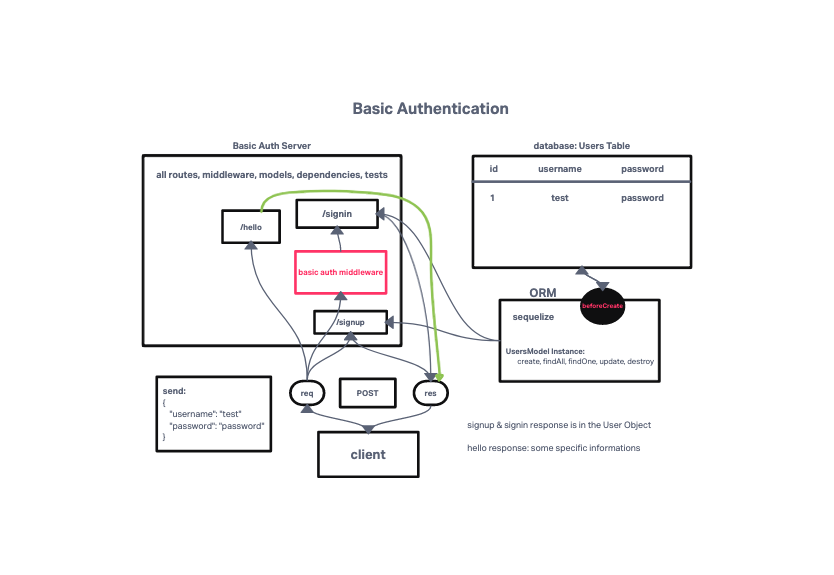

# LAB - Class 06

## Project: Basic Authorization

### Author: KC Hofstetter

### Problem Domain

We begin the first of a 3-Phase build of an authentication system, written in Express. The following core requirements detail the functionality for this phase of the project.:

- Using an HTTP REST client or a web form:
  - Make a POST request to the/signup route with username and password
  - Your server should support both JSON and FORM data as input
  - On a successful account creation, return a 201 status with the user object in the body
  - On any error, trigger your error handler with an appropriate error
- Using am HTTP REST client, or a web form:
  - Make a POST request to the /signin route
  - Send a basic authentication header with a properly encoded username and password combination
  - On a successful account login, return a 200 status with the user object in the body
  - On any error, trigger your error handler with the message “Invalid Login”

### Links and Resources

- [ci/cd](https://github.com/khofstetter94/basic-auth/pull/1)
- [back-end server url](https://kmh-basic-auth.herokuapp.com/)

### Setup

- `PORT` - 3002

#### How to initialize/run your application (where applicable)

- npm start
- nodemon

#### Features / Routes

- POST: /signin
  - takes a username and password, encrypts the password, and then is entered into the database using the UserModel schema
- POST: /signup
  - Uses Basic Auth to validate that the user exists in the database
- GET: /hello
  - Taking a name from a query, uses Basic Auth to validate the user and returns a statement saying welcoming the guest

#### Tests

- POST to /signup to create a new user
- POST to /signin to login as a user (use basic auth)
- Need tests for auth middleware and the routes
  - Does the middleware function (send it a basic header)
  - Do the routes assert the requirements (signup/signin)

#### UML

